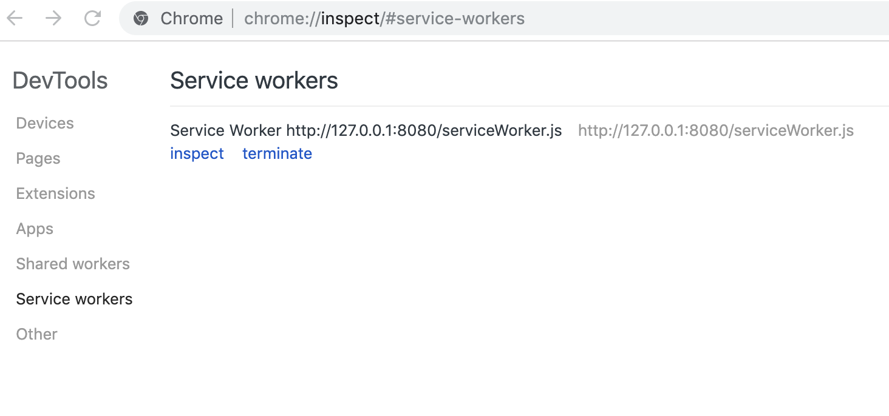
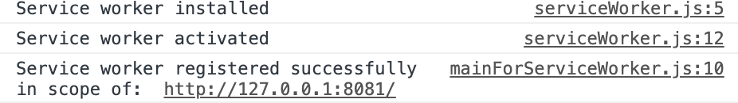

### Javascript Workers

There are web workers and service workers - two different things! They are both JavaScript workers though. This means that they can't access the DOM directly. They communicate with the web page by responding to messages sent via the `postMessage` interface.

#### Web Workers

Used to move any heavy process off of the main thread of JavaScript. There is no specific use case for web workers, their key feature is that they run seperately to the main thread. This can improve performance for a user as a site will not be rendered unresponsive during a large thread blocking process.

#### Service Workers

A proxy between the browser and the network and or the cache. Once 'installed', a service worker is able to intercept network requests made from the main document / file it was registered in. The service worke then handles whether to return a document from the cache vs going to the network to satisfy the intercepted request. This enables offline functionality.

The browser runs the service worker script in the background, distinct from the web page. It's a gateway to features that don't need user interaction to trigger them. These include:

-   Push notifications
-   Background synchonisation on a regular time interval. E.g. an app can update the content available offline by checking for content available on the network side every 15 mins.

There is no global state in the handlers as the service worker is terminated when not in use. This saves memory. If you need data to persist across restarts, they do have access to the IndexedDB API.

Service workers heavily rely on JavaScript promises.

Warning, deployed incorrectly, a service worker can break the user's browser and they wouldn't be able to tell what's causing the issue.

This is why you can only deploy a service worker if you have HTTPS on your server. Only able to use them on HTTP when localhost for developement.

Before the service worker API, offline experience was enabled via the AppCache API.

You can check that a browser is service worker compatible (i.e. has a `ServiceWorkerContainer`) via the `Navigator` API. This details the state and identity of the user agent. You can check this by calling `window.navigator` and inspecting the object.

Once registered, you can check that a service worker is enabled on your site via `chrome://inspect/#service-workers`: 

Example of logging in `serviceWorker.js` to illustrate the install, activation and successful scope of the service worker as well as the messages sent between the worker and the javascript in developement (on `localhost`):

#### Questions:

1. How do you store the static assets in the offline cache
2. How do you invalidate an asset

#### General Resources:

-   https://bitsofco.de/web-workers-vs-service-workers-vs-worklets/
-   https://medium.com/@Trott/using-worker-threads-in-node-js-80494136dbb6
-   [Node Workers Documentation](https://nodejs.org/api/worker_threads.html#worker_threads_worker_threads)
-   https://developers.google.com/web/fundamentals/primers/service-workers
-   [Service Worker Api](https://developer.mozilla.org/en-US/docs/Web/API/Service_Worker_API)
-   [AppCache](https://www.html5rocks.com/en/tutorials/appcache/beginner/)
-   [Push Notifications](https://developers.google.com/web/updates/2015/03/push-notifications-on-the-open-web)
-   [Debugging Push Notifications](https://umaar.com/dev-tips/208-push-notifications/)
-   [Background Sync](https://developers.google.com/web/updates/2015/12/background-sync)
